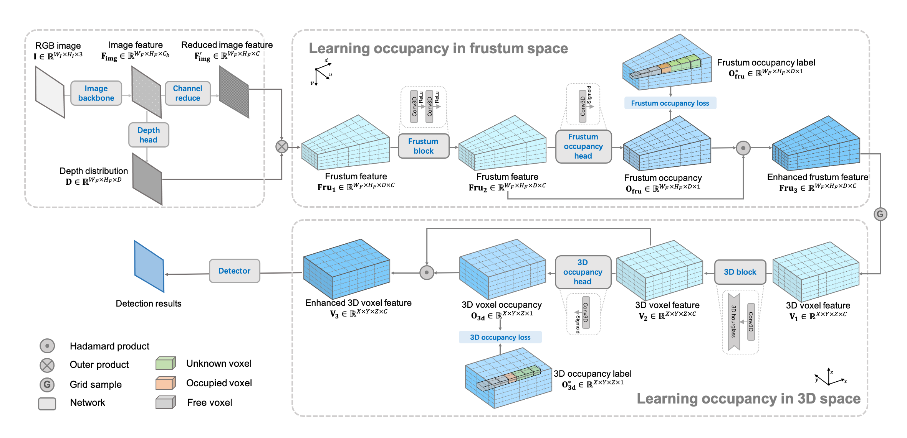

# OccupancyM3D

<p align="center">  </p>

### Note that this is an initial version, this repository needs to be further cleaned and refactored.

paper link: [[2305.15694] Learning Occupancy for Monocular 3D Object Detection](https://arxiv.org/abs/2305.15694)

## Installation

We employ the design and framework of  OpenPCDet, and follows the base setup in CaDDN, thanks for their great work! 

Therefore, please follow the installation steps in [OpenPCDet](./OpenPCDet/README.md).

## Getting Started

First, please follow the KITTI data file generation in [CaDDN](https://github.com/TRAILab/CaDDN/blob/master/docs/GETTING_STARTED.md)

Then, train and eval the model:

```shell
cd OccupancyM3D/OpenPCDet/tools
bash scripts/run.sh
```

## Pretrained Model

To ease the usage, we provide the pre-trained model at: [Google Drive](https://drive.google.com/file/d/1PBrpNVypZMNY3l2fPOs4LoVwQwep0u45/view?usp=sharing)

Here we give the comparison.

<table align="center">
    <tr>
        <td rowspan="2",div align="center">Models</td>
        <td colspan="3",div align="center">Car@BEV IoU=0.7</td>    
        <td colspan="3",div align="center">Car@3D IoU=0.7</td>  
    </tr>
    <tr>
        <td div align="center">Easy</td> 
        <td div align="center">Mod</td> 
        <td div align="center">Hard</td> 
        <td div align="center">Easy</td> 
        <td div align="center">Mod</td> 
        <td div align="center">Hard</td>  
    </tr>
    <tr>
        <td div align="center">original paper</td>
        <td div align="center">35.72</td> 
        <td div align="center">26.60</td> 
        <td div align="center">23.68</td> 
        <td div align="center">26.87</td> 
        <td div align="center">19.96</td> 
        <td div align="center">17.15</td> 
    </tr>    
    <tr>
        <td div align="center">this repo</td>
        <td div align="center">36.26</td> 
        <td div align="center">26.25</td> 
        <td div align="center">23.22</td> 
        <td div align="center">28.64</td> 
        <td div align="center">19.84</td> 
        <td div align="center">17.77</td> 
    </tr>
</table>

## Visualization Results

Some good cases and bad cases (marked using arrows)

KITTI results


Waymo results


